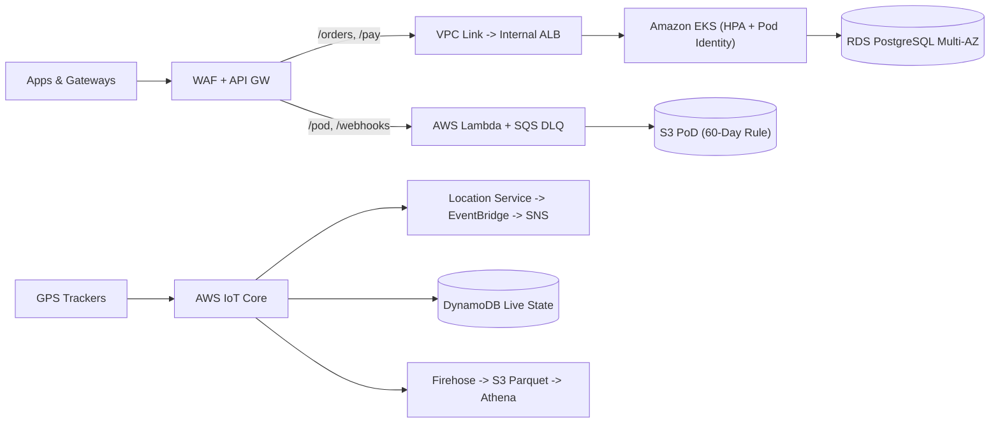

```mermaid
flowchart LR
    Clients["Apps & Gateways"] --> Edge["WAF + API GW"]
    Edge -->|"/orders, /pay"| VPC["VPC Link -> Internal ALB"]
    VPC --> EKS["Amazon EKS (HPA + Pod Identity)"]
    EKS --> RDS[("RDS PostgreSQL Multi-AZ")]
    Edge -->|"/pod, /webhooks"| Lambda["AWS Lambda + SQS DLQ"]
    Lambda --> S3PoD[("S3 PoD (60-Day Rule)")]

    Vans["GPS Trackers"] --> IoT["AWS IoT Core"]
    IoT --> Geo["Location Service -> EventBridge -> SNS"]
    IoT --> DDB[("DynamoDB Live State")]
    IoT --> Lake["Firehose -> S3 Parquet -> Athena"]
```
