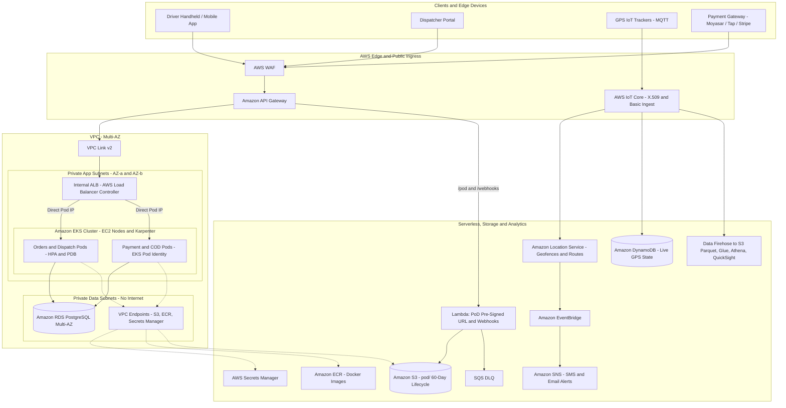

```mermaid
flowchart TB
    subgraph Clients["Clients and Edge Devices"]
        Driver["Driver Handheld / Mobile App"]
        Web["Dispatcher Portal"]
        Van["GPS IoT Trackers - MQTT"]
        PG["Payment Gateway - Moyasar / Tap / Stripe"]
    end

    subgraph Edge["AWS Edge and Public Ingress"]
        WAF["AWS WAF"]
        APIGW["Amazon API Gateway"]
        IoT["AWS IoT Core - X.509 and Basic Ingest"]
    end

    subgraph VPC["VPC - Multi-AZ"]
        VPCLink["VPC Link v2"]

        subgraph PrivateApp["Private App Subnets - AZ-a and AZ-b"]
            ALB["Internal ALB - AWS Load Balancer Controller"]
            subgraph EKS["Amazon EKS Cluster - EC2 Nodes and Karpenter"]
                Pod1["Orders and Dispatch Pods - HPA and PDB"]
                Pod2["Payment and COD Pods - EKS Pod Identity"]
            end
        end

        subgraph PrivateData["Private Data Subnets - No Internet"]
            RDS[("Amazon RDS PostgreSQL Multi-AZ")]
            VPCE["VPC Endpoints - S3, ECR, Secrets Manager"]
        end
    end

    subgraph Serverless["Serverless, Storage and Analytics"]
        LambdaPoD["Lambda: PoD Pre-Signed URL and Webhooks"]
        SQS["SQS DLQ"]
        Loc["Amazon Location Service - Geofences and Routes"]
        EB["Amazon EventBridge"]
        SNS["Amazon SNS - SMS and Email Alerts"]
        DDB[("Amazon DynamoDB - Live GPS State")]
        S3PoD[("Amazon S3 - pod/ 60-Day Lifecycle")]
        Firehose["Data Firehose to S3 Parquet, Glue, Athena, QuickSight"]
        ECR["Amazon ECR - Docker Images"]
        SM["AWS Secrets Manager"]
    end

    Driver --> WAF
    Web --> WAF
    PG --> WAF
    WAF --> APIGW
    APIGW --> VPCLink
    VPCLink --> ALB
    ALB -->|"Direct Pod IP"| Pod1
    ALB -->|"Direct Pod IP"| Pod2
    APIGW -->|"/pod and /webhooks"| LambdaPoD
    LambdaPoD --> S3PoD
    LambdaPoD --> SQS
    Pod1 --> RDS
    Pod2 --> RDS
    Pod1 -.-> VPCE
    Pod2 -.-> VPCE
    VPCE -.-> SM
    VPCE -.-> ECR
    VPCE -.-> S3PoD

    Van --> IoT
    IoT --> Loc
    Loc --> EB
    EB --> SNS
    IoT --> DDB
    IoT --> Firehose
```
