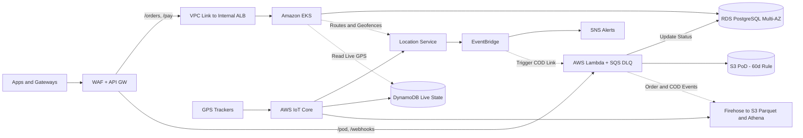

```mermaid
flowchart LR
    Clients["Apps and Gateways"] --> Edge["WAF + API GW"]
    Edge -->|"/orders, /pay"| VPC["VPC Link to Internal ALB"]
    VPC --> EKS["Amazon EKS"]
    Edge -->|"/pod, /webhooks"| Lambda["AWS Lambda + SQS DLQ"]

    EKS --> RDS[("RDS PostgreSQL Multi-AZ")]
    Lambda -->|"Update Status"| RDS
    Lambda --> S3PoD[("S3 PoD - 60d Rule")]

    Vans["GPS Trackers"] --> IoT["AWS IoT Core"]
    IoT --> Geo["Location Service"]
    IoT --> DDB[("DynamoDB Live State")]
    IoT --> Lake["Firehose to S3 Parquet and Athena"]

    EKS -.->|"Routes and Geofences"| Geo
    EKS -.->|"Read Live GPS"| DDB
    Geo --> EB["EventBridge"]
    EB --> SNS["SNS Alerts"]
    EB -.->|"Trigger COD Link"| Lambda
    Lambda -.->|"Order and COD Events"| Lake
```
